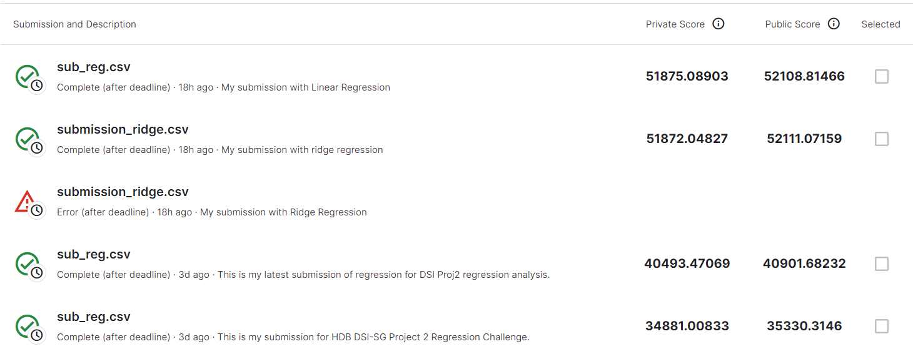

# Project 2 - HDB Housing Resale Prediction Model and Kaggle Challenge

### Primary Learning Objectives:
1. Creating and iteratively refining a regression model
2. Using Kaggle to practice the modeling process
3. Providing business insights through reporting and presentation.

### Problem Statement:

With many of the HDB flats now selling over 1 million dollars, there is a need to have a better understanding of why these flats are selling at these skyrocketing prices. Are these flats overvalued or are the prices justifable? This is where we, as data analysts need to come in and create a model to ensure that the selling price adheres to normal market standards. 

To find the best regression model to predict resale price of HDB flats. Linear Regression will be the base model use while Lasso and Ridge Regression models were used to fine-tune to get best results; using the pipeline created to predict the resale price of the test dataset.  

### Datasets
The dataset consist of train and test sets in csv format with with 77 columns of different features relating to HDB resale transaction made from 2012 to 2021.

### EDA and Data Cleaning

- Missing/Null values 
The following shows the columns that have missing values and their corresponding counts.

Mall_Nearest_Distance      829

Mall_Within_500m         92789

Mall_Within_1km          25426

Mall_Within_2km           1940

Hawker_Within_500m       97390

Hawker_Within_1km        60868

Hawker_Within_2km        29202 

It is difficult to impute any median or mean values as the location of shopping malls to various locations of the flats are quite varied. So instead of deleting the many columns, and lose the other data that might be crucial for the prediction of the housing resale prices. And also can be inferred from the heatmap_null, the correlation for these features with respect to housing resale price are insignificant. So, I will drop these columns and preserve the data relating to the other features.

- Distribution of the resale price is right skewed with very small groups of people purchasing the very expensive HDB flats.

- HDB resale price varies across flat types. Premium models like DBSS, Premium Apartments and Terraces swing the prices of the flat types to a very high price. However, they are not consider outliers. As such the predictive model must be able to predict the higher prices of these premium flat models. 

### Data Visualization Analysis

- The Number of Flats Sold by Year shows that there is a steady increase in the number of flats from 2013 till 2020.

- The Average Houing Resale Prices with repect to Different towns show that towns nearer to the city centre fetch higher resale prices as comapred to the towns on the outskirts of Singapore.

- The Housing Resale Prices vs Flat Types boxplot, the housing resale prices increase with room size. There are also the presence of outliers for 2, 3, 4, 5 Room and Executive have outliers with the highest outlier for 5 Room.

- The Housing Resale Prices vs Flat Models boxplot, shows variation for different flat models with the many outliers especially for Improved, Model A and Premium Apartments.

- The Average Housing Prices vs Flat Age at Transaction lineplot shows the younger the flat, the higher the resale price.

- Average Resale Price vs Dist from City scatterplots show that with the exception of 1 and 2 Rooms, the housing resale price decreases with increasing distance from city.

- Housing Resale Price vs Storey Level shows that the housing resale prices with storey levels of the flats.

### Features Selection
**Features selected for modeling:**
- Tranc_Year
- town
- flat_type
- flat_model
- mid
- floor_area_sqm
- mrt_nearest_distance
- age_at_tranc**
- dist_from_city**

**Prediction (y value):**
- resale_price

### Feature Transformation
- Additional column "age_at_tranc" is a tranformed feature from "Tranc_Year" minus "lease_commence_year"
- "dist_from_city" column is calculated by using haversine distance between Raffles Place's Latitude and Longitude the units' Latitudes and Longitudes.

### Preprocessing
- Preprocessing was done for the following:
    - One-hot encoding for category columns (town, flat_type, flat_model)
    - Standard Scaler for numerical columns (mid, floor_area_sqm, mrt_nearest_distance, age_at_tranc, dist_from_city)

- *Does the student investigate or manufacture features with linear relationships to the target?*

**Considerations:**

- Primary school, Hawker nearest distance and Max floor level were used intially but they seem to be lowering teh r2 score and hence were dropped eventually.

### Modeling / Pipelines

- Linear Regression is used as the baseline for scores and predictions. Initial R2 score for the baseline model is: 0.8666. 
- Lasso/Ridge Regression with default values are also used to predict housing resale prices. The R2 scores were calculated from the model, and is similar to that of the Linear Regression model.
- Then do model tuning using LassoCV/RidgeCV to find the best hyperparameter to use.

### Evaluation
- Best alpha value obtained from the previous model tuning step was added as the hyperparamenter for Lasso and Ridge.
- r2 score for Ridge is 0.871
- r2 score for Lasso are 0.867
- The best result is: Ridge
- The ridge model was chosen because it is computationally faster and the r2 score is slightly higher. And it doesn't force some features to become zeros 

### Conclusion and Recommendations

**Conclusion**

Kaggle Challenge:
</img>
i will submit my best model kaggle_model_GBR.ipynb fo Kaggle Challenge.

Project 2:

HDB Housing Resale Price Prediction Model
I will submit Ridge with the optimal alpha score obtain from the RidgeCV as my final production model.

Features Importance:

- Certain towns in Singapore especially those in the Central Zone of Singapore have HDB resale prices that is way above that of the other towns. This wide disparity in pricing caused a large variance in the resale price acoss the whole of Singapore.
- Age of the flat is also important due to the 99 years lease for every HDB flats in Singapore. So technically, the older the flats, the lower is the resale price.
- Floor type also affects the resale price. Larger flat types commands more resale price.
- Storey level of the flat will also affect the resale price of the flat. The higher the floor level of the flat, the higher will be the resale price.
- Distance from MRT station affects the resale price. The nearer the flat to the MRT station, the more expensive the flat will be.

**Recommendations**

- Other predictive models such as GradentBoostRegressor or XtremeGradientBoostRegressor would prove to be better predictive models, as these models are ensemble learning models.

- it was noticed that certain flat types/models have low number in the dataset, so in order to acheive an even distribution curve, bootstrapping is required for the whole dataset.

- For business perspective, to increase the resale price of a flat is very old, the homeowner must look into ways of improving the condition of the flat.

- Price in 2022 and 2012 may not be the exact real match due to inflation. Therefore, CPI (Consumer Price Index) should be included in the data to reflect real price of flats sold 10 years ago